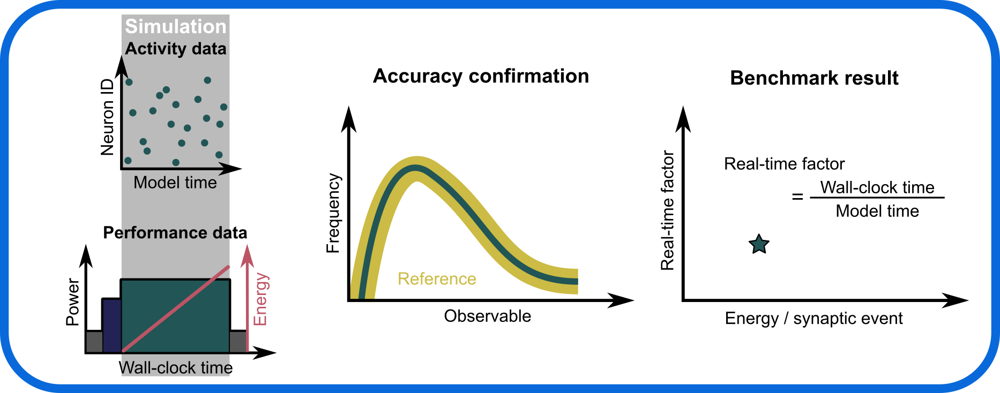

# Cortical microcircuit model (Potjans & Diesmann, 2014)

## Overview

[This repository](https://github.com/INM-6/microcircuit-PD14-model) contains a **detailed mathematical description and a reference implementation of the model** of a cortical microcircuit proposed by [Potjans & Diesmann (2014, The cell-type specific cortical microcircuit: relating structure and activity in a full-scale spiking network model. Cerebral Cortex, 24(3), 785-806)](https://doi.org/10.1093/cercor/bhs358).
The **PD14 model** describes the neuronal circuitry under one square millimeter of cortical surface.
It comprises **four cortical layers (L2/3, L4, L5, L6), each represented by a randomly connected network of excitatory and inhibitory spiking point neurons**.
The network connectivity is derived from anatomical and electrophysiological data.
Connection probabilities between neurons in the network are highly specific and depend on the cell type (excitatory, inhibitory) and on the locations (cortical layers) of the pre- and postsynaptic neurons.
In contrast to this high specificity in the connectivity, all neurons in the network are identical and share the same dynamics and parameters, irrespective of their type and location.
Similarly, all synapses are described by an identical dynamics, and differ only in the synaptic weight and spike-transmission latencies.
Synaptic weights and spike transmission latencies are randomly drawn from distributions which depend only on the type of the presynaptic neuron (excitatory or inhibitory), but are otherwise identical for all neurons and connections (with one exception).
In addition to inputs from the local network, neurons receive external inputs representing thalamic afferents and cortico-cortical inputs from more distant cortical regions.

The original purpose of this model was to understand the relationship between the connectivity and the spiking activity within local cortical circuits.
Specifically, the model demonstrates that the **observed cell-type and layer specificity of in-vivo firing rates is largely explained by the specificity in the number of connections between cortical subpopulations, and doesn't require a specificity in single neuron or synapse dynamics**.

|  |  |  |
|--|--|--|
|  |  |  |

*Sketch of the cortical microcircuit model (left), spiking activity (middle) and distributions of time averaged single-neuron firing rates across neurons in each subpopulation (right). Sketch adapted from ([van Albada et al., 2018](https://doi.org/10.3389/fnins.2018.00291)).*

In recent years, the PD14 model became an established Computational Neuroscience [benchmark](https://microcircuit-pd14-model.readthedocs.io/en/latest/benchmarking/benchmarking.html) for various soft- and hardware architectures (for an overview, see [Senk et al., 2026](https://doi.org/10.1088/2634-4386/ae379a)).

A community review ([Plesser et al., 2025](https://doi.org/10.1093/cercor/bhaf295)) prepared on the occassion of the 10th anniversary of the original publication of the model provides an historical account of the impact of the model.

## Model description

<!-- https://microcircuit-PD14-model.readthedocs.io/en/latest/model_description.html -->

A detailed mathematical, implementation-agnostic description of the model and its parameters can be [downloaded here in PDF format](https://microcircuit-pd14-model.readthedocs.io/en/latest/_static/microcircuit-pd14-model.pdf).

## Model implementation

A PyNEST implementation in the form of a Python package is [documented here](https://microcircuit-PD14-model.readthedocs.io/en/latest/pynest_implementation.html), see the [repository contents below](#repository-contents) for finding the source code and reference data.

## Performance benchmarking

Performance benchmarking results and recommendations are summarized [here](https://microcircuit-pd14-model.readthedocs.io/en/latest/benchmarking/benchmarking.html).

## Publications

A list of studies citing and/or using the PD14 model are given [here](https://microcircuit-PD14-model.readthedocs.io/en/latest/publications/publications.html).

## Repository contents

|  |  |
|--|--|
| [`docs`](docs) | Documentation|
| &emsp;[`docs/model_description`](docs/model_description) | Model description (implementation-agnostic) |
| &emsp;[`docs/benchmarking`](docs/benchmarking) | Performance benchmarking results and recommendations|
| &emsp;[`docs/publications`](docs/publications) | Publications citing/using the PD14 model|
| [`PyNEST`](PyNEST) | PyNEST implementation (Python package)|
| &emsp;[`PyNEST/src/microcircuit`](PyNEST/src/microcircuit) | Source code |
| &emsp;[`PyNEST/examples`](PyNEST/examples) | Examples illustrating usage of the Python package |
| &emsp;[`PyNEST/reference_data`](PyNEST/reference_data) | Reference spike data (generation and verification) |
| &emsp;[`PyNEST/tests`](PyNEST/tests) | Unit tests |
| [`figures`](figures) | Overview figures |

## Contact
- [Johanna Senk](mailto:j.senk@fz-juelich.de)
- [Tom Tetzlaff](mailto:t.tetzlaff@fz-juelich.de)

## Contribute
We welcome contributions to the documentation and the code via [GitHub pull requests](https://github.com/INM-6/microcircuit-PD14-model/pulls). For bug reports, feature requests, documentation improvements, or other issues, please create a [GitHub issue](https://github.com/INM-6/microcircuit-PD14-model/issues/new/choose).

## Acknowledgments
This project has received funding from the European Union’s Horizon Europe Programme under the Specific Grant Agreement No. 101147319 (EBRAINS 2.0 Project).

## License

The material in this repository is subject to different licenses:

- All material outside the `PyNEST` folder is licensed under a [Creative Commons Attribution-NonCommercial-ShareAlike 4.0 International License][cc-by-nc-sa]. For details, see [here](LICENSES/CC-BY-NC-SA-4.0.txt).
  [![CC BY-NC-SA 4.0][cc-by-nc-sa-shield]][cc-by-nc-sa]

- The material inside the `PyNEST` folder is licensed under the [GNU General Public License v2.0 or later](https://www.gnu.org/licenses/old-licenses/gpl-2.0.en.html). For details, see [here](LICENSES/GPL-2.0-or-later.txt).
  

[cc-by-nc-sa]: http://creativecommons.org/licenses/by-nc-sa/4.0/
[cc-by-nc-sa-image]: https://licensebuttons.net/l/by-nc-sa/4.0/88x31.png
[cc-by-nc-sa-shield]: https://img.shields.io/badge/License-CC%20BY--NC--SA%204.0-lightgrey.svg

