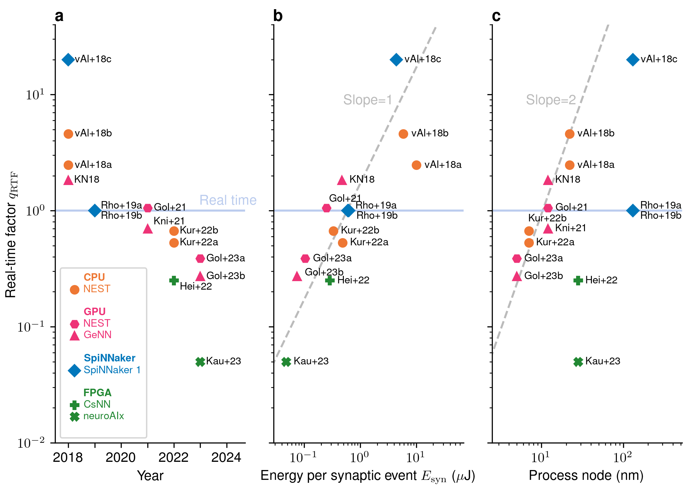

# Performance benchmarking


## Performance data of different computing platforms
```{include} figures/performance_summary.md
```
Performance data of considered studies. 
A code name disambiguates the studies and refers to the bibliography (number in brackets). 
The real-time factor $q_\text{RTF}$ and the energy per synaptic event 
$E_\text{syn}$ are the performance results obtained with the simulation 
technologies characterized by simulator name, number of nodes, system specification, and 
the process node as the industrial specification of the chip technology. The external drive 
indicates the background input used (DC or Poisson).



## Benchmarking recipe

